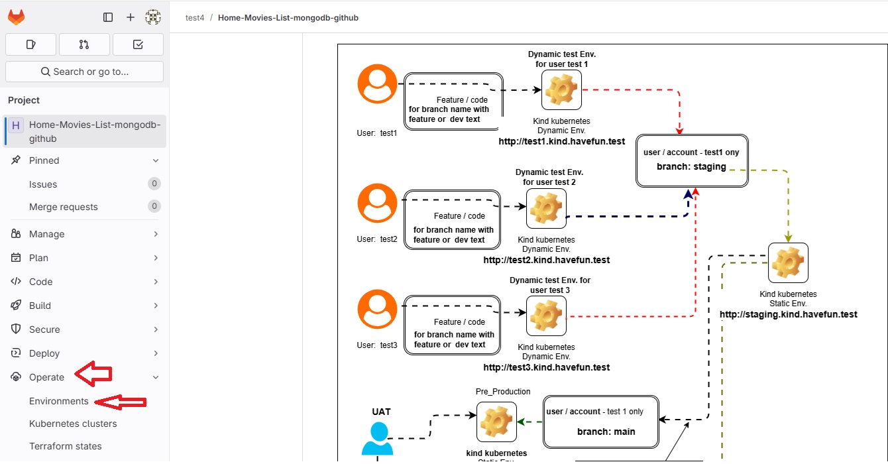
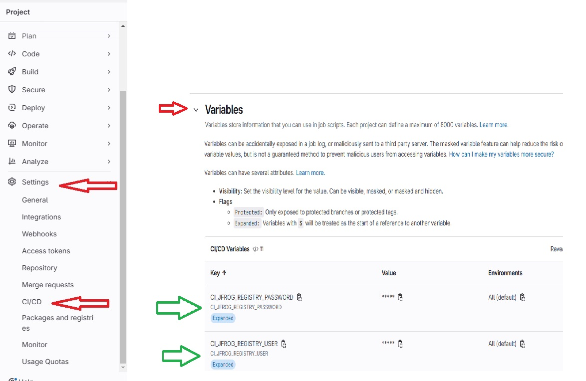
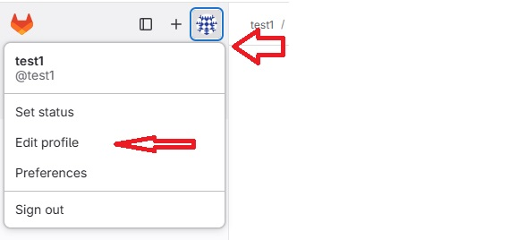
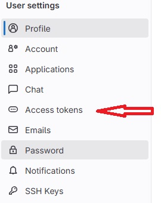
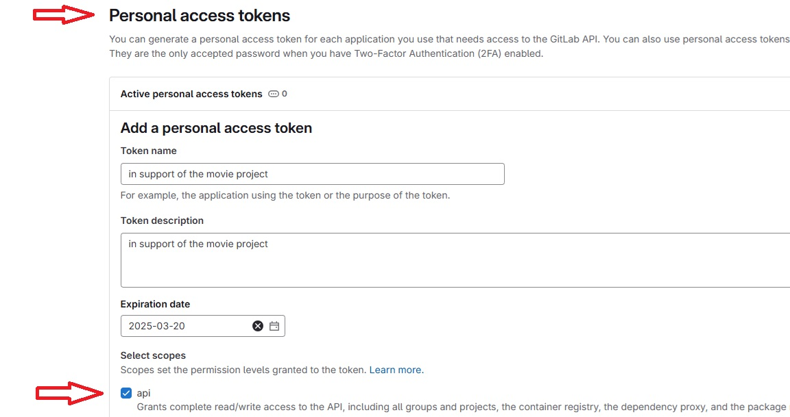
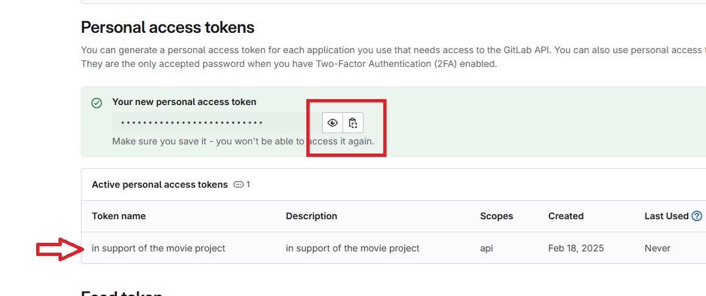
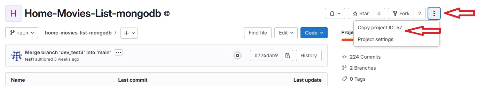

# Simple python app to track local home movies

During my time with my previous employer, I always aspired to transition into their DevOps/Cloud team to gain hands-on experience in that domain. Unfortunately, it never materialized.

To pursue this interest independently, I developed a small Python application (BETA v1.0) to track all the movies scattered across my home. The project allowed me to simulate real DevOps activities and explore open-source tools to create a basic DevOps environment. The diagram below illustrates a simplified aspect of my approach., 

# Overview 


# The software inventory for this solution is centered around GitLab CE v17.9.0, JFrog Container Registry 7.98.7, and MongoDB 8.0.4, along with additional software fully documented below.

- System Name:  kind27      
   
   - Ubuntu 22.04  

   - Docker version 27.5.1

   - kind version 0.25.0

   - Kustomize Version: v5.4.2

   - nginx/1.18.0 (Ubuntu)

- System Name:  kind28      
   
   - Ubuntu 24.04  

   - Docker version 27.5.1

   - kind version 0.26.0

   - Kustomize Version: v5.4.2   

   - nginx/1.18.0 (Ubuntu)

- System Name:  kind26      
   
   - Ubuntu 22.04  

   - MicroK8s v1.31.5 revision 7661 

   - Kustomize Version: v5.4.2

## Concept


+++

Release BETA v 1.0 

**The intention behind this project was to explore how a potential DevOps environment, utilizing a CI/CD pipeline could function & operate. This project is designed as a learning opportunity and does not represent a real production DevOps environment.** 

+++

**General concept:**

 The “test1” account (user) is the main account allowed to run the staging pipeline automatically (under the staging branch) and promote the solution to production (under the main branch) triggered manually.

 Each accounts has their own virtual space to develop and test their application based on specific branch name before the code can be promoted to staging and eventually production. This was mostly done because of the limited system and kubernetes resources within my **home lab**.

 As an example, user “test3” does all the code changes under the "feature" or “dev” branches after a fork of “test1” “main” branch. Within the GitLab pipeline configuration file (**.gitlab-ci.yml**) you will notice the pipeline script invoking different phases and staging actions. 

User "test3" can review the results of their application or code changes once the pipeline successfully completes by navigating to GitLab → Operate → Environments → review/test3 and opening the "Open" tab on the right.




Once user "test3" is satisfied with their code changes, they submit a merge request to the "test1" staging branch. User "test1" then reviews the request and either approves or rejects it.

If approved (by merging into the staging branch), this automatically triggers the staging pipeline.

If everything looks good, user "test1" merges the staging branch into the main branch and manually triggers the GitLab pipeline for deployment.

 # Important Notes:

### Note 1:

Because we are using an Nginx reverse proxy in front of the **"Kind"** Kubernetes cluster, and the GitLab local account (gitlab-runner) typically has limited privileges, I had to grant sudo privileges to the gitlab-runner account. This allows it to modify the Nginx reverse proxy configuration file as needed.

Realizing this could of been address in a different way, I opted to do it this way for now, will optimized this approach at some future release

- using "visudo" off the ubuntu system as root, below is an example of what I included

```
# Need to add some privilege to the gitlab-runner account on this system
# to manipulate nginx reverse proxy configure file.
# For the time being, I'm allowing full priv to that local account of this system.
# Future release will lock down this approach a bit more. 
#
# In support of the kind kubernetes and microk8s kubernetes 

 gitlab-runner ALL=(ALL) NOPASSWD: ALL
```

### Note 2:

 The same is required for the microk8s system for the gitlab-runner account as outlined in "Note 1" 

### Note 3: 

 Using GitLab !reference capabilities as a function, 
 implying this GitLab pipeline script is the main controlling pipeline script 

 ### Note 4:

 Because I'm using **"Kind" kubernetes** on ubuntu 22.02 & 24.04 , there is know issues with this error 
 
 **Pod errors due to “too many open files”**
 
 This may be caused by running out of inotify resources. 
 
 Resource limits are defined by fs.inotify.max_user_watches 
 and fs.inotify.max_user_instances system variables. 
 
 For example, in Ubuntu these default to 8192 and 128 respectively, which is not enough to create a cluster with many nodes.

 To increase these limits temporarily run the following commands on the host:

 sudo sysctl fs.inotify.max_user_watches=524288
 sudo sysctl fs.inotify.max_user_instances=512

 To make the changes persistent, edit the file /etc/sysctl.conf and add these lines:
 
 fs.inotify.max_user_watches = 524288
 fs.inotify.max_user_instances = 512

### Note 5:
 
 Because I'm using "self signed" cert with JFROG Container registry, I need to allow any of the systems
 local docker registry to trust the self-signed cert by adding this option  

``` 
 cat /etc/docker/daemon.json
{
 "insecure-registries": ["jfrog.pilon.org"]
}
```


 and restart docker service 

 This will allow to pull any docker images or source code from JFROG 


## .gitlab-ci.yml GitLab pipeline 

Review this script to better understand the overall flow and logic around this BETA v 1.0 release 


## OPTIONAL-curl-command bash script 

Given this is release BETA v 1.0, for the time being I'm utilizing GitLab internal mechanism to gather different credentials for different purpose. 

These required internal GitLab global variables can be found under the specific project.  



I would **strongly encourage** to review the  OPTIONAL-curl-command.sh bash script to better understand what credential variables required for each individual account / user.

This script will ask several credential questions (username / password), including GitLab account **token** and **project ID** based on the simulated account / user. If you opted to utilize the JFROG Container Registry like I have, you will also need a **JFROG TOKEN**. This is the area were you may need to make adjustments to the entire concept / solution.

### Token example 









### Project number ( ID )



## NGINX Reverse proxy 

Due to Kind Kubernetes running as Docker containers, I chose to use NGINX reverse proxy to isolate multiple Kind Kubernetes clusters on the same Ubuntu system. This setup allowed me to simulate a virtual environment for each users, ensuring separation and controlled access while maintaining flexibility in deployment. 

**The implication is that NGINX software installed on all the targeted systems  where the "Kind Kubernetes will be utilize.** 


# Staging and Pre-production K8 namespaces share the same kind kubernetes cluster 

Just to add some extract fun, you will notice from the above and below diagrams that both the staging and movie pre-produtcion K8 namespace will be operating within the staging Kind Kubernetes cluster. **The implication is that the staging stage / phase must be executed prior to unblocking/releasing the pre-production &  production deployment phase/stage** 


# Security

You will notice I did include some open source security scanners within the pipeline, although limited in nature. I also left some of the errors the scans identified  for review given this project is for learning purposes.  

# MongoDB

Within this project I opted to utilize mongodb in a **shard** configuration as I wanted to experiment with MongoDB is a bit more.  

A MongoDB sharded cluster is a distributed database architecture that partitions data across multiple servers (shards) to improve scalability, performance, and fault tolerance. Sharding enables MongoDB to handle large datasets and high-throughput operations by distributing data based on a shard key. Each shard operates as an independent database, and a mongos router directs queries to the appropriate shards. A config server maintains metadata and manages cluster configurations. This approach ensures horizontal scaling and helps balance the load across nodes while maintaining high availability.

How it Works:

- Data Partitioning: MongoDB partitions data across shards based on the shard key.

- Query Routing: The mongos router determines which shard(s) store the relevant data and directs queries accordingly.
 
- Metadata Management: Config servers maintain a mapping of shard key ranges to shards.

- Replication & High Availability: Each shard is typically a replica set, ensuring redundancy and fault tolerance.


## create_mongodb_container_v5.1.sh script

ℹ️ **Information:**

The script **"create_mongodb_container_v5.1.sh"** includes the use of:
    
- Percona Open Source MongoDB  https://www.percona.com/mongodb/software/mongodb-distribution instead of the default MongoDB CE

- Percona Monitoring and Management

- Percona Backup for MongoDB

 - In addition:

   - Added some logic to run this script in a CI/CD pipeline 

   - Optimized a few areas of the script, and cleaned the bash syntax 

    - Added support for both logical and physical Percona (bpm) backup & restore 

**Disclaimer**

**- The outcome of this script is NOT supported by MongoDB Inc or by Percona under any of their commercial support subscriptions or otherwise**

📌 Script can be found here now: [[Hyperlink]](https://github.com/hpilon/MongoDB) - https://github.com/hpilon/MongoDB


## Comparison if MongoDB CE vs PErcona MongoDB 

# 📊 MongoDB Products Comparison

| Feature / Product | MongoDB Community (CE) | MongoDB Enterprise | Percona Server for MongoDB (PSMDB) | Percona MongoDB Professional (Prof) |
|:------------------|:----------------------|:-------------------|:----------------------------------|:------------------------------------|
| License           | Server Side Public License (SSPL) | Commercial License | Open Source (SSPL + Percona modifications) | Commercial Support Package |
| Cost              | Free                   | Paid Subscription   | Free                              | Paid Support Plan                  |
| Support           | Community support only | Official MongoDB Inc. support | Community support + optional paid Percona support | Full Percona enterprise support |
| Security Features | Basic (Authentication, TLS) | Advanced (LDAP, Kerberos, Encryption at Rest) | Advanced (LDAP, Encryption at Rest, Audit Logs, KMIP) | Same as PSMDB + tuning, hardening |
| Backup Tools      | mongodump/mongorestore | Ops Manager + Cloud Manager Backups | Percona Backup for MongoDB (PBM) | PBM + Full Backup/Recovery support |
| Monitoring        | Basic (manual tools)    | Advanced via Ops Manager / Cloud Manager | Percona Monitoring and Management (PMM, Free) | Full Monitoring + tuning |
| Sharding & Replication | Yes               | Yes                 | Yes                              | Yes                                |
| Enterprise Integrations | No                | Yes (LDAP, Kerberos, SNMP, etc.) | Yes (LDAP, Kerberos, KMIP) | Yes                               |
| Hot Backups       | No                     | Yes                 | Yes (via PBM and hot backup) | Yes                                |
| Performance Enhancements | No              | Some                | Some (better memory tuning, RocksDB optional) | Yes (custom tuning support) |
| Encryption at Rest | Only via filesystem tools | Built-in          | Built-in                         | Built-in + Enterprise hardening     |
| Cloud Services Integration | No            | Yes (Atlas)         | No (self-host only)            | No (self-host only)                      |
| Management Tools  | Manual or Community Tools | Ops Manager, Cloud Manager | PMM (Free)         | PMM + Expert Analysis               |

---

# 🧐 **Summary:**

| Product | Best For |
|:--------|:---------|
| MongoDB CE | Developers, small teams, self-managed deployments |
| MongoDB Enterprise | Large companies needing integrated tools and official MongoDB Inc. support |
| Percona Server for MongoDB | Advanced users wanting free enterprise features and open-source tools |
| Percona MongoDB Prof | Companies needing professional 24/7 support and proactive database management |

---

# 📌 Important Notes:
- **Percona Server for MongoDB (PSMDB)** is MongoDB with **enterprise-grade features for free**.
- **Percona MongoDB Professional** is **professional services and support** on top of PSMDB or MongoDB CE/Enterprise.


# Kind kubernetes cluster and kubectl commands that maybe of interest 

I create this **kind_cluster_context_and-notes.txt** file to help with isolating the different Kind kubernetes cluster that maybe operating off the same Ubuntu system when using the kubectl command. 

```
kind get kubeconfig --name test1 > kubeconfig-test1.yaml ; export KUBECONFIG=kubeconfig-test1.yaml

kind get kubeconfig --name test2 > kubeconfig-test2.yaml ; export KUBECONFIG=kubeconfig-test2.yaml

kind get kubeconfig --name test3 > kubeconfig-test3.yaml ; export KUBECONFIG=kubeconfig-test3.yaml

kind get kubeconfig --name test4 > kubeconfig-test4.yaml ; export KUBECONFIG=kubeconfig-test4.yaml

#
# Keep in mind that both the staging and movie K8 namespaces share the same Kind Kubernetes cluster, 
# in this case being the staging Kind kubernetes cluster 
#

kind get kubeconfig --name staging > kubeconfig-staging.yaml; export KUBECONFIG=kubeconfig-staging.yaml

#
kubectl config get-contexts
#
kubectl exec -it <pod name>> -n <name space> -- bash
#
#
# to logon into a specific pod 

Example:

kubectl get pod -n test3

# once you know the pod name 

kubectl exec -it movie-deployment-<XXXXXXXX> -n test3 -- bash

```
